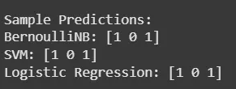

# Twitter Sentiment Analysis using Python

Twitter Sentiment Analysis is the process of automatically determining whether a tweet expresses a positive or negative opinion. This project uses Python and machine learning techniques to analyze tweet sentiment and convert raw text data into meaningful insights.

---

## 🔍 Why Twitter Sentiment Analysis?

Millions of tweets are posted daily, reflecting opinions about brands, products, events, and social issues. By analyzing this data:

- Businesses can measure customer satisfaction
- Companies can monitor brand reputation
- Governments and researchers can track public mood
- Organizations can respond quickly to negative feedback

---

## 🛠 Technologies Used

- Python
- Pandas
- Scikit-learn
- TF-IDF Vectorization
- Machine Learning Models:
  - Bernoulli Naive Bayes
  - Support Vector Machine (SVM)
  - Logistic Regression

---

## 📂 Dataset

This project uses the **Sentiment140 Dataset**.

### Download Instructions:
1. Visit Kaggle
2. Search for **Sentiment140 Dataset**
3. Download `training.1600000.processed.noemoticon.csv.zip`
4. Place it in the project root directory

---

## ⚙️ Step-by-Step Implementation

### Step 1: Install Required Libraries
pip install pandas scikit-learn

Step 2: Load the Dataset
We load the CSV file, keep only polarity and tweet text, and rename columns.

Step 3: Filter Sentiment Labels
Remove neutral tweets
Map:
0 → Negative
4 → Positive

Step 4: Clean Tweet Text
All tweets are converted to lowercase for consistency.

Step 5: Train-Test Split
80% Training data
20% Testing data
Fixed random state for reproducibility

Step 6: Text Vectorization
TF-IDF converts text into numerical features using:
Unigrams and Bigrams
Maximum 5000 features

Step 7: Train Bernoulli Naive Bayes
A probabilistic classifier suitable for binary text features.

Step 8: Train Support Vector Machine (SVM)
A powerful classifier for high-dimensional text data.

Step 9: Train Logistic Regression
A linear model commonly used for text classification.

Step 10: Sample Predictions
Example tweets are classified as:
1 → Positive
0 → Negative

---

## 📊 Sample Output

